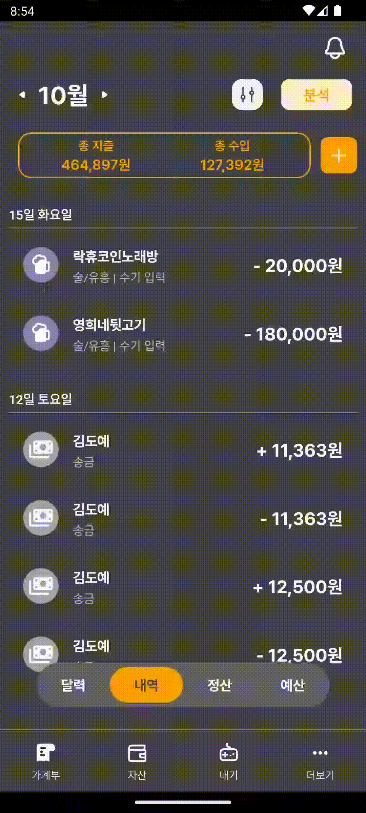
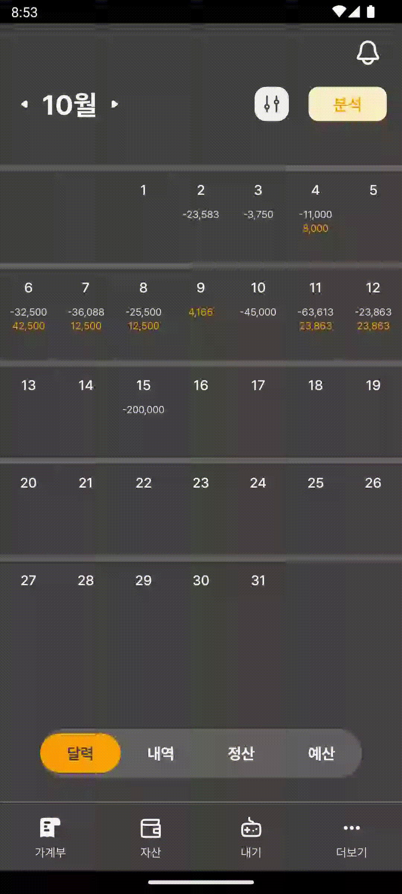
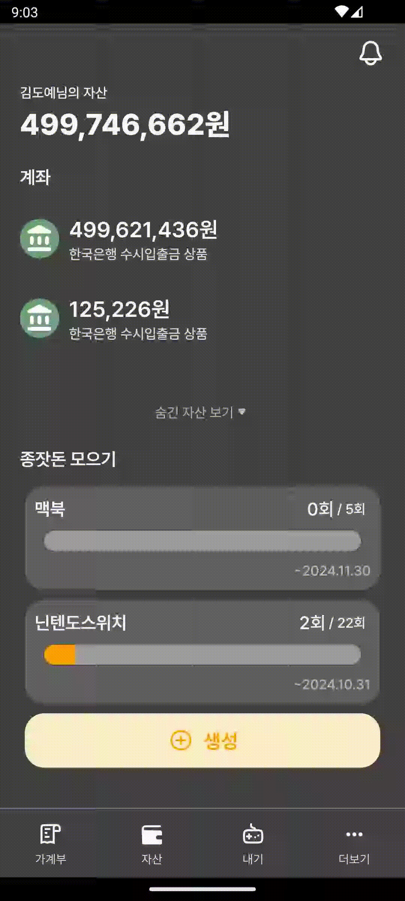
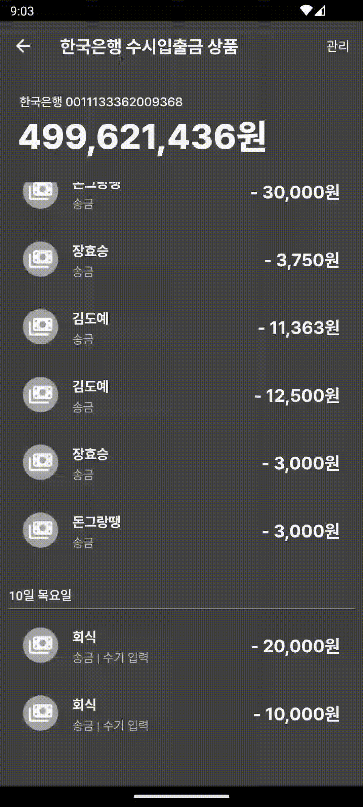
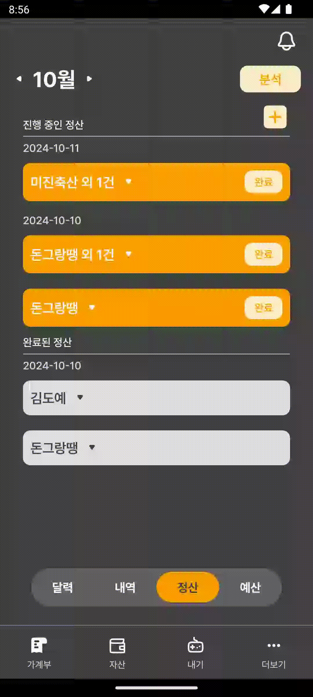
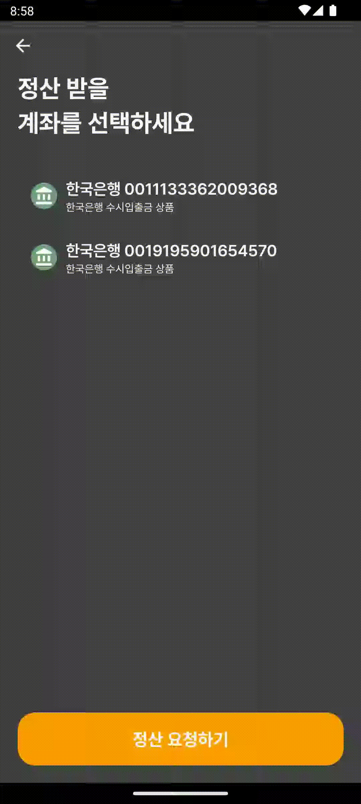
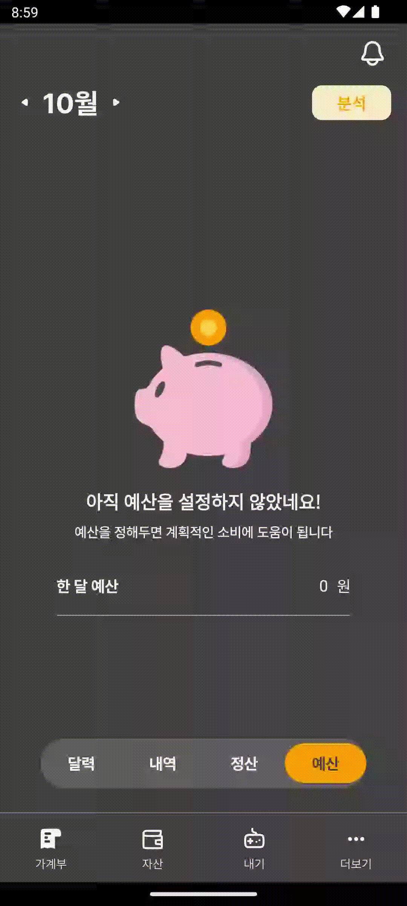
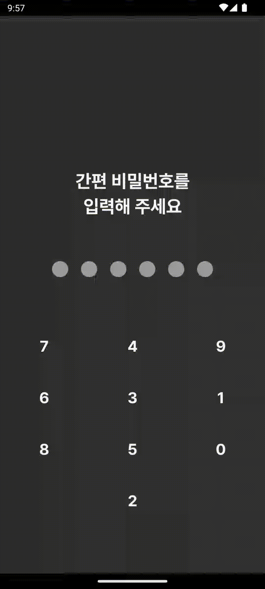
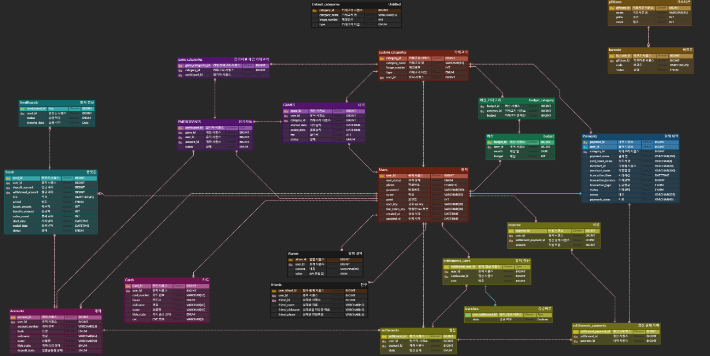
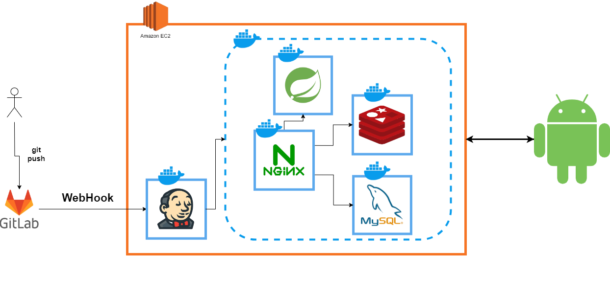

## 서비스명

> 돈그랑땡

## 서비스 소개

> 정산내역과 내역분리 기능을 지원하는 가계부 애플리케이션

 

🙆‍♀️ **서비스 대상**

1. 수기 가계부 작성에서 애플리케이션으로 전환하고 싶으신 분
2. 친구들과 정산을 자주하는 분
3. 가계부 작성을 꼼꼼히 하고 싶은 분
    
    

💡 **주요 기능**

1. 자동조회(내역 동기화)
   >
2. 내기
   >
3. 리포트
   >
4. 종잣돈
   > 사고 싶은 물품을 위해 저축계좌로 자동 이체를 지원합니다.
5. 포인트
   > 내기 참여, 종잣돈 모으기 등의 활동을 통해 포인트를 획득할 수 있습니다.
6. 기프티콘 상점
   > 보유한 포인트를 가지고 상점에서 기프티콘을 구매할 수 있습니다.

  

## 프로젝트 정보

📅 **진행 일정**

- 2024.08.26 ~ 2024.10.04 (총 8주)

👨‍👧‍👦 **팀원 소개**
| 공원영 (팀장) | 이현규 | 송도언 | 권혜경 | 김도예 | 장효승 |
| --- | --- | --- | --- | --- | --- |
| BE | BE/Infra| BE | BE | FE | FE |

📁 **기획/설계 문서**

- [와이어프레임](https://www.figma.com/design/3GGOQHPMdaPDApfU2mcNT4/%EB%8F%88%EA%B7%B8%EB%9E%91%EB%95%A1?node-id=0-1&t=KcKOlQZxBXTNbAyZ-1)

 

## 주요 기능 소개(.gif)

|                  가계부 탭                  |            수기 등록            |              카테고리 필터링               |
| :-----------------------------------------: | :-----------------------------: | :----------------------------------------: |
|  |  |  |

|               자산 상세               |             자산 숨김             |
| :-----------------------------------: | :-------------------------------: |
|  |  |

|               정산 내역 선택                |               정산 친구 선택                |               정산 금액 설정                |
| :-----------------------------------------: | :-----------------------------------------: | :-----------------------------------------: |
|  |  |  |

|               정산 계좌 선택                |                  정산 요청 알림                   |
| :-----------------------------------------: | :-----------------------------------------------: |
|  |  |

|              예산 생성              |           예산 생성 상세            |
| :---------------------------------: | :---------------------------------: |
|  |  |

<table>
    <tr>
        <td colspan="2">게임 생성</td>
    </tr>
    <tr>
        <td></td>
        <td></td>
    </tr>
</table>

|             게임 탭             |               진행 게임 상세                |                대기 게임 상세                 |
| :-----------------------------: | :-----------------------------------------: | :-------------------------------------------: |
|  |  |  |

|             종잣돈 생성             |             종잣돈 상세             |
| :---------------------------------: | :---------------------------------: |
|  |  |

|         알림 내역         |           분석            |      더보기(포인트상점)       |
| :-----------------------: | :-----------------------: | :---------------------------: |
|  |  |  |

|          다크모드          |          라이트모드          |
| :------------------------: | :--------------------------: |
|  |  |

## ERD 다이어그램

## 인프라

